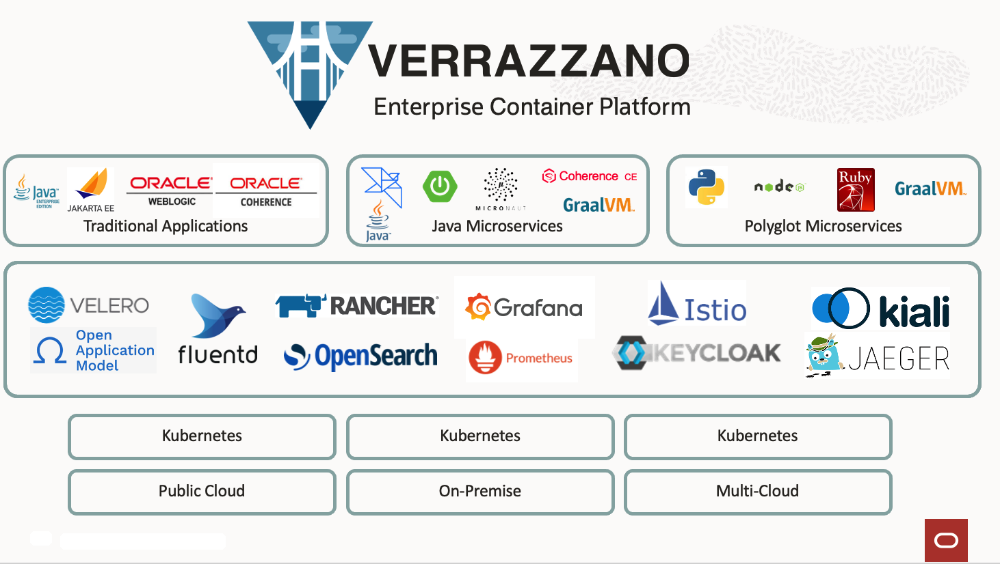

# Introduction

## About this Workshop

This lab shows you how to install the Verrazzano platform on a single Kubernetes cluster and deploy a sample tomcat application docker image using Verrazzano concepts.

This workshop is designed to be as self-explanatory as possible, but feel free to ask for clarification or assistance along the way.

Estimated Time: 90 minutes

### Objectives

* Set up your Oracle Cloud Free Tier account (if you haven't done so already).
* Set up an Oracle Kubernetes Engine instance on the Oracle Cloud Infrastructure.
* Install the Verrazzano production profile.
* Create sample tomcat application docker image.
* Deploy tomcat application to OKE using Verrazzano.
* Explore Grafana, Prometheus and OpenSearch Dashboard console.

### Prerequisites

* You must have an [Oracle Cloud Infrastructure](https://cloud.oracle.com/en_US/cloud-infrastructure) enabled account.

## About Tomcat

Apache Tomcat is an open-source web server and servlet container that is widely used to deploy Java-based web applications. Tomcat is designed to be lightweight, efficient, and easy to use, and it provides a rich set of features for managing and deploying web applications. 

## About Verrazzano

Verrazzano is an end-to-end enterprise container platform for deploying cloud-native and traditional applications in multi-cloud and hybrid environments. It is made up of a curated set of open source components – many that you may already use and trust, and some that were written specifically to pull together all of the pieces that make Verrazzano a cohesive and easy-to-use platform.

Verrazzano includes the following capabilities:
- Hybrid and multicluster workload management
- Special handling for WebLogic, Coherence, and Helidon applications
- Multicluster infrastructure management
- Integrated and pre-wired application monitoring
- Integrated security
- DevOps and GitOps enablement

## Learn More

* [https://tomcat.apache.org/](https://tomcat.apache.org/)
* [https://verrazzano.io/](https://verrazzano.io/)

## Acknowledgements

* **Author** -  Ankit Pandey
* **Contributors** - Maciej Gruszka, Sid Joshi
* **Last Updated By/Date** - Ankit Pandey, March 2023
